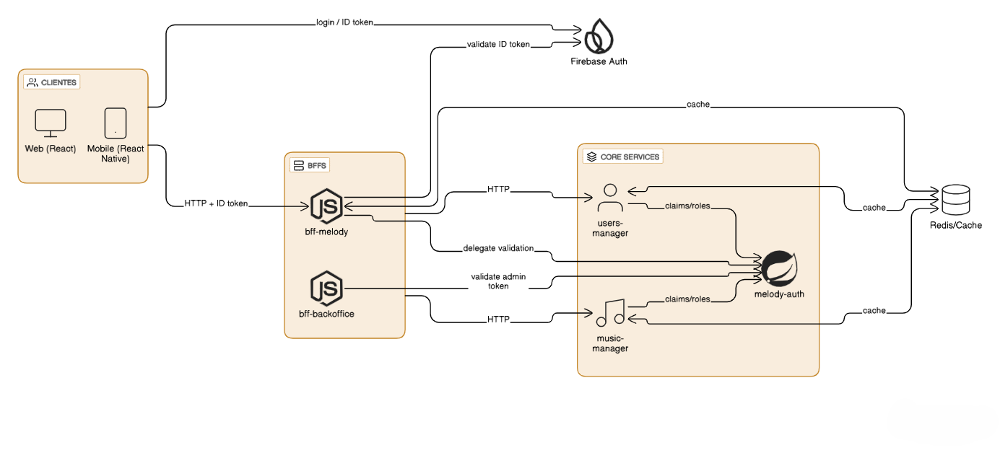

# 🏗️ Arquitectura del Sistema

Este documento describe la arquitectura general de Melodía, sus microservicios, tecnologías utilizadas y las decisiones técnicas que guiaron el diseño del sistema.

---

## 📡 Diagrama de Arquitectura

---

# 🧠 Decisiones de Arquitectura

A lo largo del desarrollo se tomaron decisiones claves que dieron forma al sistema. Estas son las más importantes:

---

## 1. **Separación en Microservicios**

Melodía no es un monolito, sino un ecosistema modular compuesto por servicios independientes:

- **melody-auth** (Java + Spring Boot)  
  → Autenticación centralizada, gestión de tokens, login, verificación de credenciales y sesiones.

- **music-manager** (Node + NestJS + MongoDB + Firebase Storage)  
  → Gestión de canciones, álbumes, géneros, subida de archivos.

- **users-manager** (Node + NestJS + Postgres)  
  → Manejo de usuarios, perfiles, follows, configuraciones.

- **BFF (Backend for Frontend)**  
  → Capa intermedia para unificar entrada desde web + mobile y simplificar al frontend.

### ¿Por qué microservicios?

- El equipo era multidisciplinario → se podían desarrollar módulos en paralelo.  
- Escalabilidad independiente: el servicio de música genera mucha más carga que auth.  
- Facilidad de reemplazo: cada servicio puede migrar tecnología sin afectar a los demás.  
- Entornos aislados → errores en un servicio no rompen todo el sistema.

---

## 2. **Elección de Tecnologías**

### **Java + Spring Boot para Autenticación**
- Robustez para validación de tokens y sesiones.  
- Integración madura con JWT y seguridad.  
- Ideal para lógica crítica que debe ser estable.

### **Node + NestJS para la mayoría de los servicios**
- NestJS ofrece arquitectura modular, escalable y muy rápida de desarrollar.  
- DX excelente → CLI, decoradores, inyección de dependencias.  
- Los servicios podían ser trabajados por varios desarrolladores al mismo tiempo.

### **MongoDB para música / metadatos**
- Las canciones y álbumes son documentos naturalmente jerárquicos.  
- Lecturas rápidas y flexibilidad en esquemas.

### **PostgreSQL para usuarios**
- Datos estructurados + relaciones (seguidores, perfiles, settings).  
- Integridad referencial.

### **Firebase Storage para audio**
- Hosting barato y escalable.  
- SDK simple desde frontend y backend.  
- No se quería manejar buckets directamente desde un servidor propio.

---

## 3. **BFF como puerta de entrada**

El BFF simplifica al frontend:

- Valida el token en un solo lugar.  
- Unifica rutas de todos los microservicios.  
- Permite enriquecer respuestas (por ejemplo: metadata + artista).  
- Evita que el frontend conozca múltiples endpoints.

---

## 4. **CI/CD & Contenedores**

Se eligió:

- **Docker** para hacer cada servicio portable.  
- **GitHub Actions** para correr tests, compilar, pushear imágenes.  
- **Codecov** para métricas de calidad del código.

---

## 5. **Modelo orientado a eventos (Event Bus)**

Aunque no se implementó por completo, el diseño lo contempla:

- Publicar eventos: música subida, usuario registrado, playlist creada.  
- Consumir eventos: estadísticas, notificaciones, recomendaciones.  
- Escalabilidad reactiva → no bloquea otros servicios.

---

## 6. **Frontends independientes**

- Web App (React)
- Mobile App (React Native)
- Backoffice (React)

¿Por qué separados?  
Porque cada uno tiene un público distinto y necesidades diferentes, pero comparten el BFF.

---

## ✔️ En Resumen

Melodía está diseñada como una plataforma moderna, modular, escalable y preparada para crecer.  
La arquitectura permitió que el equipo trabajara de manera paralela, evitando bloqueos, y facilitando evolucionar cada módulo independientemente.

---

Si querés, puedo:

✅ agregar secciones adicionales (trade-offs, decisiones rechazadas)  
✅ generar una versión más extensa tipo *informe académico*  
✅ generar una versión corta tipo *executive summary*  
✅ agregar un segundo diagrama (flujo de autenticación, flujo de subida de audio, etc.)

¿Querés extender el documento?
